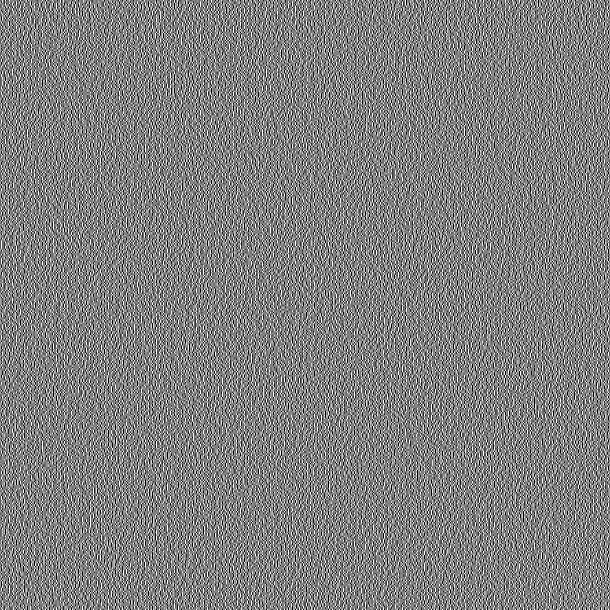
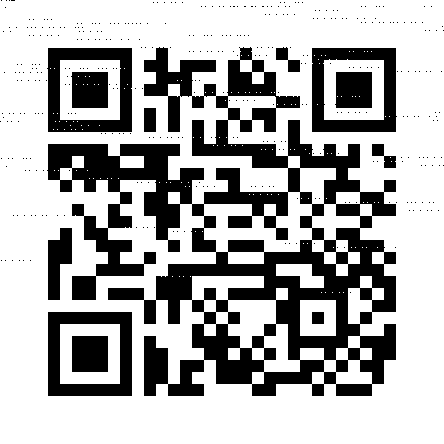

# VSS
*Solution and write-up, playing for [Kalmarunionen](https://capturetheflag.withgoogle.com/scoreboard/kalmarunionen). 

We are given a python [source file](vss.py), and an 888x888 image which appears to be random noise. 


The challenge description suggests some kind of image based threshold scheme.

## TL;DR
- Flag is encoded in a QR code, which is saved as an image
- This image is then encoded in an information theoretic secret sharing between two new share images
- They use python.random to flip the coin for each pixel encoded, which is not a secure source of randomness. As the last 48 lines of the original image are known, (white pixels,) we can deduce enough bits of the random stream to break the mersene twister PRG which python uses for randomness.
- Knowing the full random bit stream, we can reconstruct from only one share to recreate original image and read QR code.

## Initial Observations
At first we spent some time looking through the encoding, and reading up on QR codes. While enough of the QR code format is fixed that we could reconstruct a significant portion of the second share, all the areas with data were information theoretically hidden by the encoding scheme.

The encoding scheme works as follows, for each pixel in the source image, a 2x2 group of 4 pixels is generated in share 1, with the left two having one colour and the right two having another colour. If the original pixel was white, then share 2 gets an identical 2x2 group of pixels, and if it was black, share 2 gets an inverted group of pixels.

The choice of whether the left two pixels are white or black is done by flipping a random bit, generated as a long stream of random bits using random.getrandbits.

This means if we know the random bits, we could deduce each pixel in the original image from only the top left of each corresponding group of 4 pixels in share 2. However without knowing the randomness, this is information theoretically hiding, as share 1 is essentially a one time pad for share 2.

### Broken randomness
This left the randomness as the only thing left to attack.

Python uses a mersene twisted PRG, which can be broken. If we can get it to generate 624 consecutive 32 bit integers, then we can predict the next large number of bits with very high accuracy.

We found this python implementation [RandCrack](https://github.com/tna0y/Python-random-module-cracker) which worked well for us, so now we just the first 624 * 32 bits which were generated when creating share 2.

One note which caused us some issues, when you call random.getrandbits(x), we discovered that it generates 32 bit integers one at a time, and concatenates their binary representation, with the first one generated being put at the very end of the final bitstring.

This, combined with the fact that we know the last 48 lines of the image are white pixels, means we can deduce the first 48*444 bits in the sequence, as the upper left pixel in each group in share 2 is `color0`, where:

```python
        color0 = 0 if flipped_coins[idx] else 255
        color1 = 255 if flipped_coins[idx] else 0
```

This means we can reverse engineer the bitstream for the last 48 lines as:

```python
bitstream = []
    for idx in range(48 * 444):
        i, j = idx//n + 444 - 48, idx % n
        if share2.getpixel((2*j, 2*i)):
            bitstream.append(0)
        else:
            bitstream.append(1)
    bitstream = "".join([str(x) for x in bitstream])
```

Now that we have these, we just need to reverse the order, and feed it into randcrack 32 bits at a time, and it can approximate the flipped_coins for the rest of the image.

#### Code
Our solution in (slightly messy) python.

```python
import qrcode  # https://github.com/lincolnloop/python-qrcode
import random
import os
from PIL import Image
from randcrack import RandCrack # https://github.com/tna0y/Python-random-module-cracker
from textwrap import wrap
# import zxing # only needed to read data from output inside the script. Requires Java

def main():
    # Generate placeholder image with hidden data which generates a QR code of 444x444
    # Was useful for size information, formats etc. Not really needed
    qr = qrcode.QRCode(
        version=1,
        error_correction=qrcode.constants.ERROR_CORRECT_L,
        box_size=12,
        border=4,
    )
    qr.add_data("ZZZZZZZZZZZZZZZZZZZZZZZZZZZZZZZZZZZZZZZZZZZZZZZZZZZZZZZZ")
    qr.make(fit=True)
    img = qr.make_image(fill_color="black", back_color="white")
    m, n = img.size

    # load share 2
    share2 = Image.open('share2.png')

    # Calculate randomness bitstream from last 624 * 32 bits of padding
    # We know the last 48 * 444 pixels were white, so can deduce random bits used from only share2.png
    bitstream = []
    for idx in range(48 * 444):
        i, j = idx//n + 444 - 48, idx % n
        if share2.getpixel((2*j, 2*i)):
            bitstream.append(0)
        else:
            bitstream.append(1)
    bitstream = "".join([str(x) for x in bitstream])


    # Load bitstream, and use cracker to simulate mersene twister state
    rc = RandCrack()

    # As getrandbits Generates sets of 32 bit integers, and puts the first ones generated at the end of the sequence of bits,
    # we need to invert the sequence so we give the last bits (the first generated) to randcracker in the right order
    splitstream = wrap((bitstream), 32)
    splitstream.reverse()

    # Seed the mersene twister cracker with 624 32 bit integers
    for i in range(624):
        val = int(splitstream[i],2)
        rc.submit(val)

    # Predict randomness for all remaining pixels in source image
    newlist = bin(rc.predict_getrandbits(444 * 444))[2:].zfill(444 * 444)

    # Add the calculated randomness back onto the end of the approximated randomness
    splitstream2 = newlist[-(444*444 - (32 * 624)):] + bitstream[-(32 * 624):]
  
    # Given the known randomness, we can reconstruct the original image from share2.png
    original = []
    for k in range(444 * 444):
        # l = k + 444*444 - 1 % (444*444)
        i, j = k//n, k % n
        if share2.getpixel((2*j, 2*i)):
            if int(splitstream2[k]):
                original.append(0)
            else:
                original.append(255)
        else:
            if int(splitstream2[k]):
                original.append(255)
            else:
                original.append(0)

    # Save the resulting data back into an image
    res = Image.new("L", img.size, 255)
    res.putdata(original)
    res.save('result3.png')
    
    # # Read data out of image, and print to console. Optional QoL step using zxing
    # # Can also just use any qr code reader app or service on result3.png
    # reader = zxing.BarCodeReader()
    # barcode = reader.decode("result3.png")
    # print(barcode.parsed)

if __name__ == '__main__':
    main()
```

The output image. Note the occasional incorrect pixels due to imperfect randomness simulation.



Flag: `n1ctf{bf3724e3-c26b-4a63-9b4f-b33024b1db63}`
